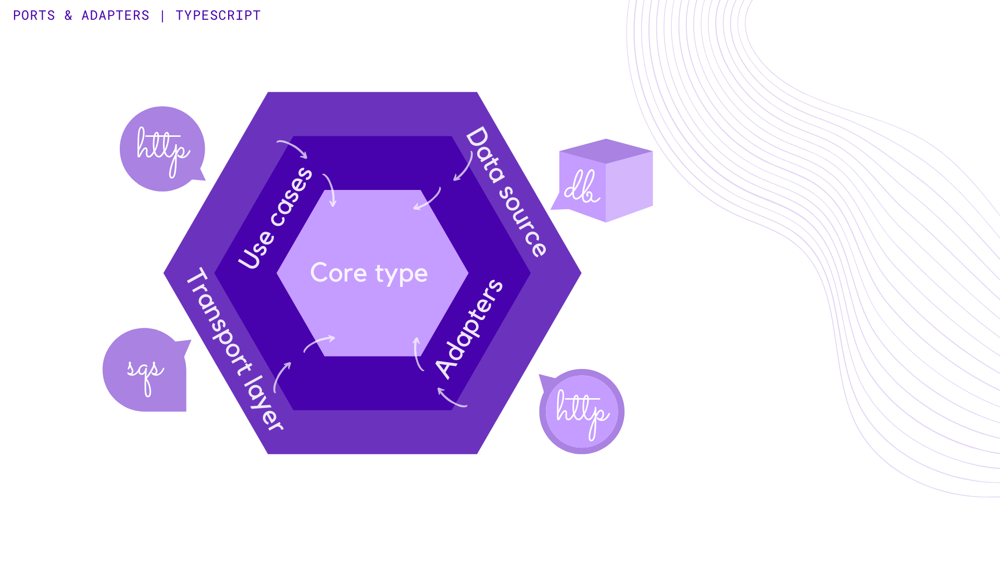

A *type safe functional* implementation of the hexagonal architecture in typescript 


#### usecase
The usecase layer represents the business rules of the software. It encapsulates the constraints around
the core types. Therefore all the *use cases*. A change in this layer should not affect the core types.
Also changes external to usecases, in the outer layer, should not generate any changes in
this layer.

#### adapter
Adapters are responsible for converting the data between the outer layer
(http transport, storages, third party services, etc) and the inner layer
(use cases and core types). Data representations are converted through decoding/encoding.  
`core.adapter` is the main adapter which decodes any unknown data to a core type.
Besides the core adapter, there is also the `storage.adapter`, which handles
data transport between database engines and the application 
[(more about decoding)](docs/DECODE.md).

#### protocol
Protocols setup any required infraestructure for the communication between the 
outmost layer and the external world.


### Getting Started

```bash
$ cp .env.sample .env && yarn install
```

### Running in docker

```bash
# compiling docker compose
$ docker-compose -f docker/docker-compose.yml build

# running the stack
$ docker-compose -f docker/docker-compose.yml up -d

# get logs of the application
$ docker-compose -f docker/docker-compose.yml logs -f app

# run just the database
$ docker-compose -f docker/docker-compose.yml run --service-ports --detach db
```

### Tests

```bash
# unit tests
$ yarn test

# watch unit tests (transpile only)
$ yarn test:watch

# in a new window watch build with noEmit
$ yarn build:watch

# run code coverage
$ yarn test:cover

# open html report in default browser
$ yarn test:cover:open

# integration tests
$ yarn test:integration

# functional tests
$ yarn test:functional
```

### References & Inspiration:
* https://netflixtechblog.com/ready-for-changes-with-hexagonal-architecture-b315ec967749
* https://github.com/nubank/basic-microservice-example
* https://blog.cleancoder.com/uncle-bob/2012/08/13/the-clean-architecture.html
* https://www.youtube.com/watch?v=US8QG9I1XW0
