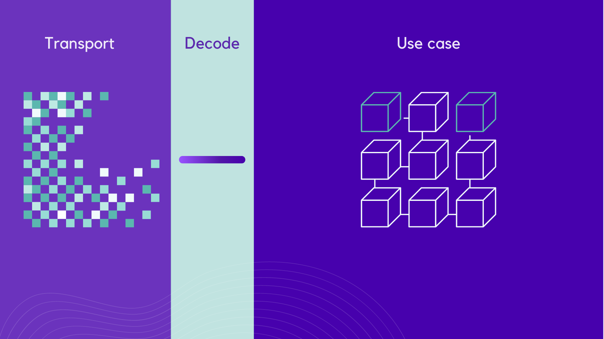

decoding is the process of parsing any unknown data into a defined type.
[io-ts](https://github.com/gcanti/io-ts) is the tool of choice to support an easy & safe decoding.
Every decode happens through a specification called `codec`. The data is given to the codec, which
can decode it into the type derived from itself.

```ts
import * as t from 'io-ts'
import { decode } from '@adapter/codec/decode'

const User = t.type({
  name: t.string,
  age: t.number
})

type User = t.TypeOf<typeof User>

function createUser(user: User) { /* ... */ }

const john = decode(User, {
  name: 'john doe',
  age: 40
})

createUser(john)
```

Failure to decode any data will result in a `DecodeError` runtime exception.
Every `DecodeError` will be caught by an http error middleware, which will set the response as bad request.

```ts
const user = decode(User, { foo: 'bar' })

// =>
// [DECODE ERROR]: Expecting number at age but instead got: undefined
//   Expecting string at name but instead got: undefined
//   at new DecodeError (...)

```

### layers
Every input to the usecase layer should be decoded, making sure the constraints on the type
will always be checked upon data that comes in. As pictures above, decoding can be seem as a
thin layer between the transport layer and the usecase layer. This includes all data that comes from
any adapters, databases inclusive.

### codec granularity and strictness
there are two aspects to consider when defining codecs: granularity and strictness

the more fine grained your codecs are, the more flexible they will be. On the flip side, 
combinations will be required to decode bigger chunks of data:
```ts
const todo = decode(Todo, { description: 'create todo list', done: false })
// => { description: 'create todo list', done: 'false' }

const todo = decode(identified(Todo), { description: 'create todo list', done: false })
// => DecodeError, expecting Id at id but instead got: undefined
```
an union type should be preferred to represent different shapes an entity can take
```ts
export const CompletedTask = t.type({
  description: t.string,
  done: t.literal(true),
  date: t.union([DateFromISOString, date])
})

export const PendingTask = t.type(
  description: t.string,
  done: t.literal(false)
)

export const Todo = t.union([CompletedTask, PendingTask])
```

having strict codecs means most of the validations can be pushed to the boundaries of the system.
Whenever the type is found, the application can be sure of the integrity of the entity.
On the other hand, strict codecs can't be expressed in typescript types, thus enforcing explicit
check over creation within the application

```ts
// loose codecs
const User = t.type({
  name: t.string,
  age: t.number
})

const john: User = { name: 'john doe', age: 40 }
// ok!

// strict codecs
const User = t.type({
  name: NonEmptyString,
  age: PositiveInt
})

const john: User = { name: 'john doe', age: 40 }
// Compilation error: cannot assign string to NonEmptyString at name
// Compilation error: cannot assign number to PositiveInt at age

const [name, age] = ['john doe', 40]
if (isNotEmptyString(name) && isPositive(age))
    const john: User = { name, age }
    // ok!
    ...

// or just decode it...

const john: User = decode(User, { name: 'john doe', age: 40 })
// ok!
```
